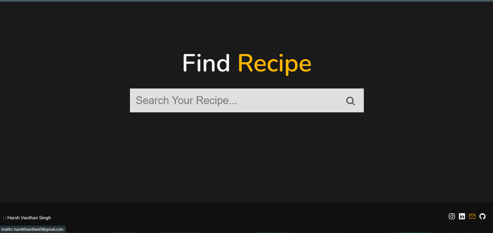
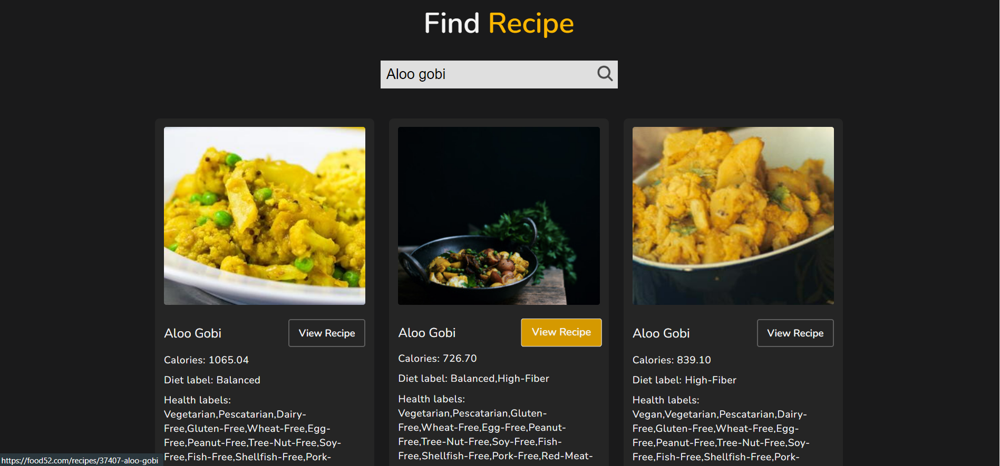

## Overview 👀

- **Easy Search🧐**
- **Desktop first design ✌🏻**
- **Clean UI ⚡**

# About
 - A simple Web based application that Search over 2.3 million recipes in English using EDAMAM Recipe Search API. 
 - Created using HTML,CSS for the designing.
 - Vanilla Javascript is used to fetch and display the different recipes to the users.
 - Media queries are used to make page responsive .
 - User Friendly

# *References*

* For Fonts: [Google Fonts](https://fonts.googleapis.com/css2?family=Work+Sans:wght@300&display=swap)
* For Color Coordination: [w3schools](https://www.w3schools.com/colors/colors_mixer.asp?colorbottom=000000&colortop=FFFFFF)
* For JavaScript (Tutorial): [Udemy - Angela Yu](https://www.udemy.com/course/the-complete-web-development-bootcamp/)
* For help with CSS: [w3 schools](https://www.w3schools.com/css/)

# *Contributions*

Contributors are welcome!
## *WEBSITE DEMO*

# *Author*

* Sarthak Tomar (sarthaktomargenius@gmail.com)
